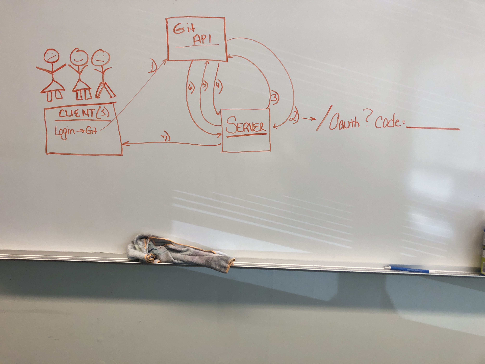

# LAB - 12 

## Project Name
# www-basic-auth

### Author: Tia Rose, Feliple Delatorre, Chloie Parsons

### Links and Resources
* [submission PR](https://github.com/tia-rose-401-advanced-javascript/www-basic-auth/pull/1)
* [heroku](https://rocky-lake-53437.herokuapp.com/)
* 

#### Documentation
* [api docs](http://xyz.com) (API servers)
* [jsdoc](http://xyz.com) (Server assignments)
* [styleguide](http://xyz.com) (React assignments)

### Modules
#### `modulename.js`
##### Exported Values and Methods

###### `foo(thing) -> string`
Usage Notes or examples

###### `bar(array) -> array`
Usage Notes or examples

### Setup
#### `.env` requirements
* `PORT` - Port Number
* `MONGODB_URI` - URL to the running mongo instance/db
* `GOOGLE_CLIENT_ID` - 
* `GOOGLE_CLIENT_SECRET` - 

#### Running the app
* `npm start`
* Endpoint: `/foo/bar/`
  * Returns a JSON object with abc in it.
* Endpoint: `/bing/zing/`
  * Returns a JSON object with xyz in it.
  
#### Tests
* How do you run tests?
* What assertions were made?
* What assertions need to be / should be made?

#### UML

